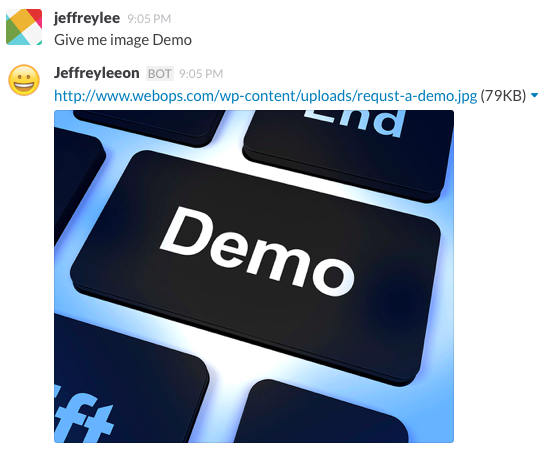
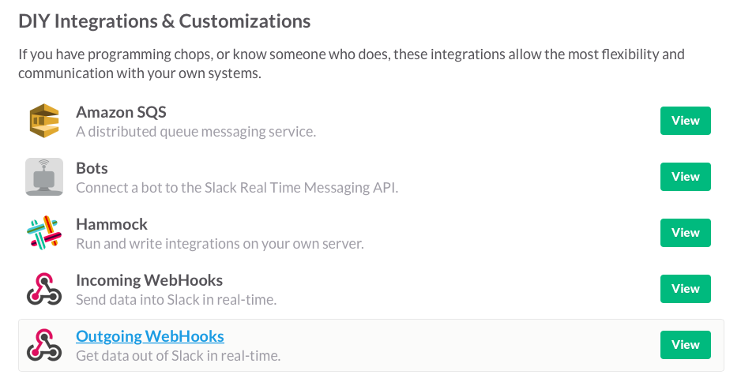
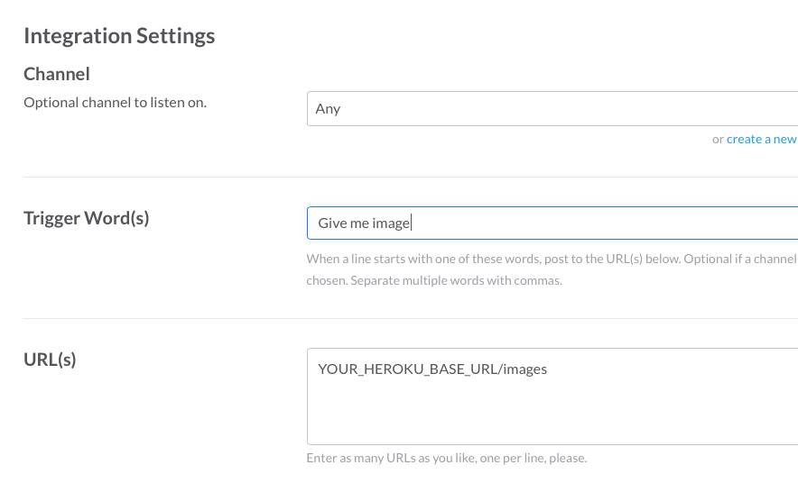
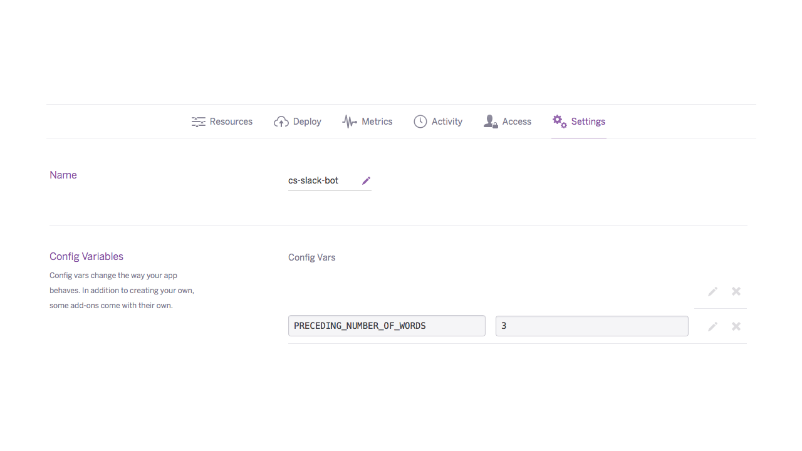

# Slack image bot (Hosted by Heroku)



### Required bin
- npm
- node
- heroku (Depends on where you want to host it)

### Getting Started
- Push the project to Heroku
    - Set number of workers by ```heroku ps:scale web=1```
- Create Outgoing Webhook in Slack
    -  Slack -> Configure integrations -> DIY Integrations & Customizations -> Outgoing WebHooks
    
    - Setup trigger words and your hosting url, remember route ```/images``` is a must (Ok anyway, you can change it if you wish to)
    
- Setup environment variable
    - In order to trim out trigger words, need to supply ```PRECEDING_NUMBER_OF_WORDS``` as an environment variable. This will trim out "Give me image".
    
- Happily ask for images
    - Give me image Done

### Credits
- Personal code
- Code not licensed. Idea from others, not from myself
- This is only one of the way to do the job and it is not perfect, feel free to improve it! ;)
